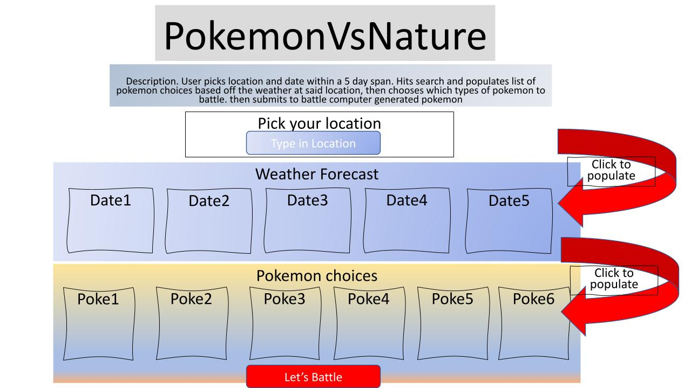

## Project 1: PokeWeather Webpage

**Version 1.0**

# Description:

In this application we wanted to have a fun way for users to get the current weather and associate that with different pokemon. If the user types in a city location, then the page will display a 5 day weather forecast. Then, if the user selects a day in the forecast, that weather will pull up a list of Pokémon.

# User Story:

AS a Pokémon Gamer
I WANT to see Pokémon recommendations based on the weather
SO THAT I can understand how weather affects my Pokémon

# Original Wireframe:

 \

# Built Utilizing:

Materialize v1 - <https://materializecss.com/> \
PokeAPI - <https://pokeapi.co/> \
Open Weather API - <https://openweathermap.org/api> \

# Screenshot:

# Deployed Application:

https://ribbonanarchy.github.io/PokemonVsNature/

# Future Development:

1. Complete CSS styling for our battle.html page
2. Create two containers within the arena for user/computer Pokémon choices.
3. Create JavaScript for the two Pokémon to battle with the weather on the chosen day affecting them positively or negatively
4. Get audio to function correctly within Chrome
5. Incorporate GIPHY API for Pokémon animations
6. Expand to include all generations of Pokémon
7. Develop code for mobile use (iOS/Android)

# Contributors:

Robyn Arnecke - <https://github.com/ribbonanarchy> \
Leland Byrd - <https://github.com/Byrdbass> \
Benjamin Gomez - <https://github.com/bennygo3> \
Randy King Jr. - <https://github.com/rkingjr> \
